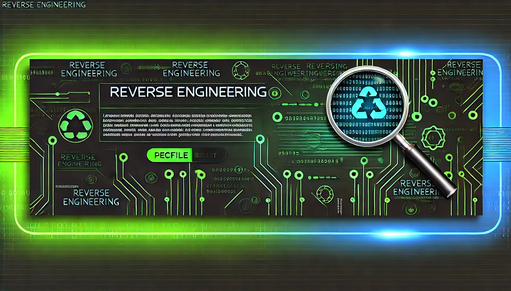

# Crypt Files [VmProtect] Reverse Engineering, SMM Marketing & Arbitrage Project

## Overview

This project combines several advanced technologies and methodologies to build a system for **crypto reverse engineering**, **SMM marketing**, and **arbitrage**. The project uses multiple programming languages and databases to handle different aspects of the workflow.

## Key Features

- **Crypto Reverse Engineering**: Analyze blockchain transactions and smart contracts.
- **SMM Marketing**: Automated marketing strategies for social media platforms.
- **Arbitrage**: Identify and exploit price differences in cryptocurrency markets.
- **Database Support**: MySQL, PostgreSQL, MongoDB, and Redis integration for efficient data storage and retrieval.
- **Multiple Programming Languages**: A versatile tech stack including JavaScript, HTML, CSS, PHP, Python, and Java.

## Tech Stack

### Frontend
- **JavaScript**: For client-side scripting and building interactive web applications.
- **HTML/CSS**: To create the user interface of the platform.

### Backend
- **PHP**: Server-side scripting for handling business logic.
- **Python**: For automating tasks, data analysis, and interacting with the blockchain.
- **Java**: For complex algorithm implementations and performance optimization.

### Databases
- **MySQL**: Structured database for user data and transactional records.
- **PostgreSQL**: For handling more complex database queries and analytics.
- **MongoDB**: A NoSQL database for flexible, document-based data.
- **Redis**: In-memory data structure store for caching and real-time analytics.
